Multivariate Correspondence Analysis - Project
================

## Overview

This project was implemented for the Aalto University course
Multivariate Statistical Analysis. The purpose of this project was to
choose one method of multivariate statistical analysis covered by the
course and perform the analysis on a data set that could also be chosen
freely. I chose the same data set which I had already used in a
[previous machine learning
project](https://github.com/MattiHyyppa/ML-property-price-prediction)
but analysed the data set from a different perspective. The data set
consists of properties that have been for sale in Melbourne between 2016
and 2018.

The directory structure is as follows:

-   `data`: contains the CSV data file. The source of the data set is
    [Kaggle](https://www.kaggle.com/datasets/anthonypino/melbourne-housing-market).
-   `mca.Rmd`: the notebook containing the multiple corresponding
    analysis performed on the chosen data set
-   `images`: where the figures generated by the `mca.Rmd` notebook are
    saved for further analysis.
-   `mca_files`: an auto-generated directory containing the figures
    plotted in the `mca.Rmd` notebook. RStudio generates this directory
    automatically when the notebook is knitted into a regular markdown
    file so that the markdown file can reference the plotted figures.
-   `project-report.pdf`: my project report submitted for the Aalto
    University course Multivariate Statistical Analysis. The project
    report contains a more in-depth explanation about all the steps of
    the analysis.

## A step-by-step tutorial

This section contains a step-by-step tutorial of the multivariate
statistical analysis thats also available in the `mca.Rmd` notebook. The
notebook has been run with the following versions of software:

-   R: 4.1.2
-   RStudio: 2021.09.1+372

The following libraries are needed for running the notebook. If you
don’t have all the packages, you can install the missing ones with the
command `install.packages("packageName")`. RStudio will also prompt
about the missing packages.

``` r
library(dplyr)
library(ca)
library(corrgram)
library(leaflet)
library(mapview)
library(png)
library(grid)
library(htmltools)
library(class)
library(ggplot2)
library(reshape2)
library(scales)
```

> If you want knit the `mca.Rmd` file into a regular markdown file in
> RStudio, you should also remember to install PhantomJS with the
> command `webshot::install_phantomjs()`. PhantomJS is needed to be able
> to take screenshots from a Leaflet map with the `mapview` package.
> However, there can be some problems with `mapview` depending on the
> operating system and the installed package version meaning that
> screenshotting the Leaflet map might not work. Therefore, if you just
> want to run the notebook, it is easier to just set the
> `use_interactive_map` variable to `TRUE` (the variable is declared a
> couple of code blocks below). Then, PhantomJS (and also mapview) are
> not needed.

Let’s define some helper methods for showing and saving the plots
generated by the notebook.

``` r
# Plot a figure with `plot_fn` function and save it in a file with `filename`.
save_fig_and_plot <- function(filename, plot_fn) {
  # Open a plot device and plot the figure there
  png(filename = filename, width = 25, height = 16, units = "cm", res = 300)
  plot_fn()
  out <- dev.off()

  # Read the figure from the file and render it
  img <- readPNG(filename)
  grid.raster(img)
}
```

``` r
# Plot and save a ggplot figure.
save_ggplot_and_show <- function(filename, plot) {
  ggsave(filename, plot, width = 16, height = 10, units = "cm", dpi = 300)
  plot
}
```

In RStudio, it is possible to plot an interactive Leaflet 2D map which
is useful for visualizing the properties of the data set on a map.
However, the interactive map cannot be used when knitting the notebook
into a regular markdown file. Therefore, `use_interactive_map` is set to
`FALSE` for generating this markdown file but can also be set to `TRUE`
when running the notebook in RStudio.

``` r
use_interactive_map = FALSE
```

Let’s read the data from the CSV file. The CSV file should be located in
a `data` directory that has been created in the project’s root.

``` r
df <- read.csv("data/Melbourne_housing_FULL.csv", sep = ",", header = T)

# Rename some of the fields
df <- rename(df, Bed = Bedroom2, Land = Landsize, Area = BuildingArea,
             Bath = Bathroom, Year = YearBuilt, Dist = Distance,
             Region = Regionname, PropertyCount = Propertycount,
             Lat = Lattitude, Lon = Longtitude)

# The `Dist` column describes the distance from the property to central business
# district in kilometers. However, for some reason, the column is of type string.
# Convert it to float.
df$Dist <- as.numeric(df$Dist)
```

Let’s create shorter forms for the region names.

``` r
df$Region[df$Region == "Northern Metropolitan"] <- "N"
df$Region[df$Region == "Western Metropolitan"] <- "W"
df$Region[df$Region == "Southern Metropolitan"] <- "S"
df$Region[df$Region == "Eastern Metropolitan"] <- "E"
df$Region[df$Region == "South-Eastern Metropolitan"] <- "S-E"
df$Region[df$Region == "Northern Victoria"] <- "N Vic"
df$Region[df$Region == "Eastern Victoria"] <- "E Vic"
df$Region[df$Region == "Western Victoria"] <- "W Vic"
```

Correlation matrix for univariate data analysis.

``` r
save_fig_and_plot("images/correlation.png", function() {
    (corrgram(df, upper.panel = panel.cor))
  }
)
```

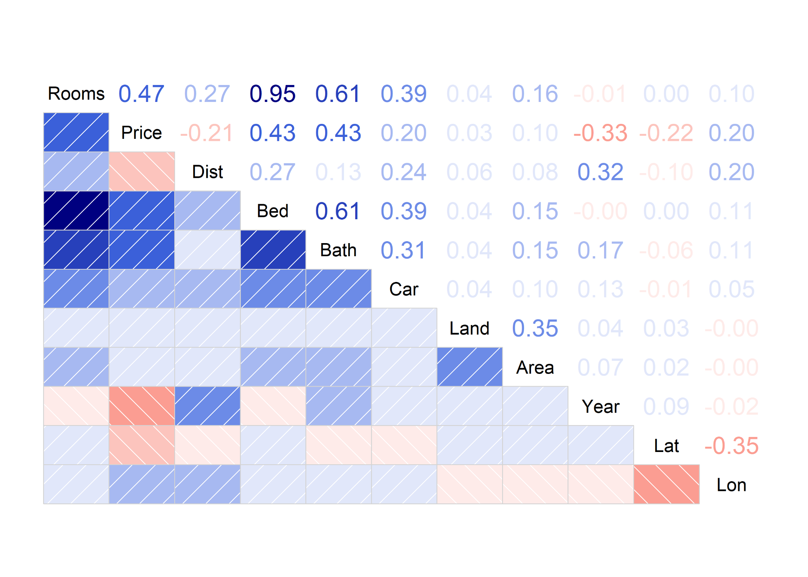

Let’s calculate how many missing values there are in the data set for
each variable. Then, let’s plot them with a `ggplot` barplot.

``` r
na_count <- function(x) {
  is_na <- is.na(x)
  (sum(is_na))
}

na_values <- sapply(df, na_count)
na_values <- data.frame(na = na_values)
na_values["feature"] <- rownames(na_values)

g <- ggplot(na_values, aes(x = feature, y = na, fill = feature)) +
     geom_bar(stat = "identity") +
     theme(
       axis.text.x = element_text(angle = 90, vjust = 0.5, hjust=1, size = 10),
       axis.text.y = element_text(size = 10),
       legend.position = "none",
       plot.title = element_text(hjust = 0.5, size = 14),
       axis.title = element_text(size = 12),
       panel.background = element_rect(fill = "#F0F0F0")
     ) +
     labs(x = "Feature", y = "Number of NA values", title = "Number of NA values per feature")

save_ggplot_and_show("images/na_values_per_feature.png", g)
```

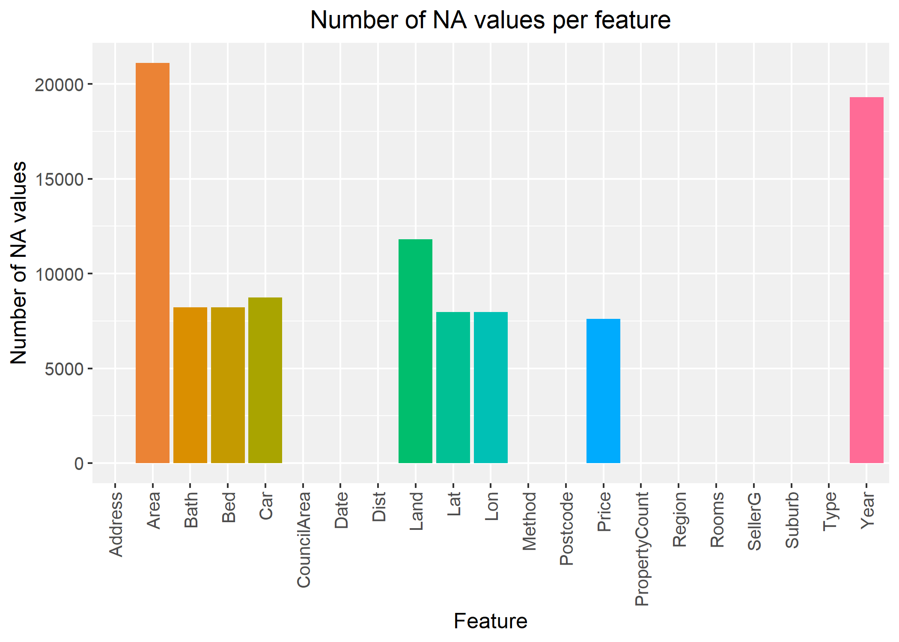

``` r
# Number of rows in total
dim(df)[1]
# Result: 34857

# Number of rows with missing values for Bath
sum(is.na(df$Bath))
# Result: 8226

# Number of rows with missing values for Bath, Lat or Lon
sum(is.na(df$Bath) | is.na(df$Lat) | is.na(df$Lon))
# Result: 8252

# Number of rows with missing values for Price
sum(is.na(df$Price))
# Result: 7610

# Number of rows with missing values for Bath, Lat, Lon or Price
sum(is.na(df$Bath) | is.na(df$Lat) | is.na(df$Lon) | is.na(df$Price))
# Result: 14079
```

``` r
# Columns we choose for the analysis.
# Check the project report for the justification of this choice.
cols <- c("Rooms", "Bath", "Price", "Dist", "Lat", "Lon", "Region")
df <- df[cols]

# Drop rows with NA values.
# Check the project report for the justification of this choice.
df2 <- df[complete.cases(df), ]

# Verify that the number of rows matches what we calculated previously
dim(df2)
# Result: (20778, 7)

df <- df2
```

Let’s define a color palette for the regions so we can plot them on a
map with different colors.

``` r
num_regions <- length(unique(df$Region))
color_palette <- palette(rainbow(num_regions))
pal <- colorFactor(color_palette, domain = unique((df$Region)))
```

Create a Leaflet map and display the properties as circle markers with
different colors depending on the region of the property. If you set
`use_interactive_map` as `TRUE` previously, an interactive Leaflet map
is displayed on the console. Otherwise only a screenshot of the map is
displayed to be able to knit the `mca.Rmd` file into markdown.

``` r
# Create the Leaflet map
m <- leaflet(df) %>%
  addTiles() %>%
  addCircleMarkers(
    radius = 3.5,
    color = ~pal(Region),
    stroke = FALSE,
    fillOpacity = 1.0,
    lng = ~Lon,
    lat = ~Lat,
    popup = ~htmlEscape(paste0("Lat: ", Lat, ", Lon: ", Lon))
  ) %>%
  addLegend(pal = pal, values = ~Region, opacity = 1)

if (use_interactive_map) {
  # Print the interactive HTML map
  m
} else {
  # Save a screenshot of the map to a png file
  map_file = paste0(getwd(), "/images/regions_before.png")
  mapshot(m, file = map_file)
  
  # Display the screenshot
  map_image <- readPNG(map_file)
  grid.newpage()
  grid.raster(map_image)
}
```

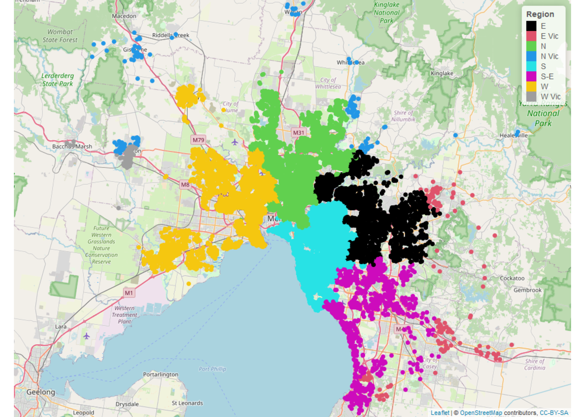

From the map, we can see that some regions have very few properties.
Multiple correspondence analysis is sensitive to having small categories
which makes it a non-robust method in that sense. Let’s use k-NN with
`k = 3` to merge the properties belonging to the smaller regions
(`E Vic`, `N Vic` and `W Vic`) to the closest larger ones (`N`, `E`,
`S`, `S-E` or `W`).

``` r
df$Region <- as.factor(df$Region)
regions_to_merge <- c("E Vic", "N Vic", "W Vic")

# Test set consists of properties whose region we want to predict using k-NN.
# These include the properties belonging to the regions E Vic, N Vic and W Vic.
test <- is.element(df$Region, regions_to_merge)

# The train set consists of properties whose regions the predictions are based on.
# --> All the properties in the other regions than E Vic, N Vic and W Vic.
train <- !test

# We perform k-NN using the latitude and longitude of the properties.
df_train <- df[train, c("Lat", "Lon")]
df_test <- df[test, c("Lat", "Lon")]
train_labels <- df$Region[train]

# k-NN with k = 3
test_labels <- knn(df_train, df_test, train_labels, k = 3)

# Let's update the data frame using the new regions and let's drop the unused ones.
df[test, "Region"] <- test_labels
df$Region <- droplevels(df$Region)
```

Let’s look at the map, again. There are no more super small categories
in terms of the regions of the properties.

``` r
m <- leaflet(df) %>%
  addTiles() %>%
  addCircleMarkers(
    radius = 3.5,
    color = ~pal(Region),
    stroke = FALSE,
    fillOpacity = 1.0,
    lng = ~Lon,
    lat = ~Lat,
    popup = ~htmlEscape(paste0("Lat: ", Lat, ", Lon: ", Lon))
  ) %>%
  addLegend(pal = pal, values = ~Region, opacity = 1)

if (use_interactive_map) {
  m
} else {
  map_file = paste0(getwd(), "/images/regions_after.png")
  mapshot(m, file = map_file)

  map_image <- readPNG(map_file)
  grid.newpage()
  grid.raster(map_image)
}
```

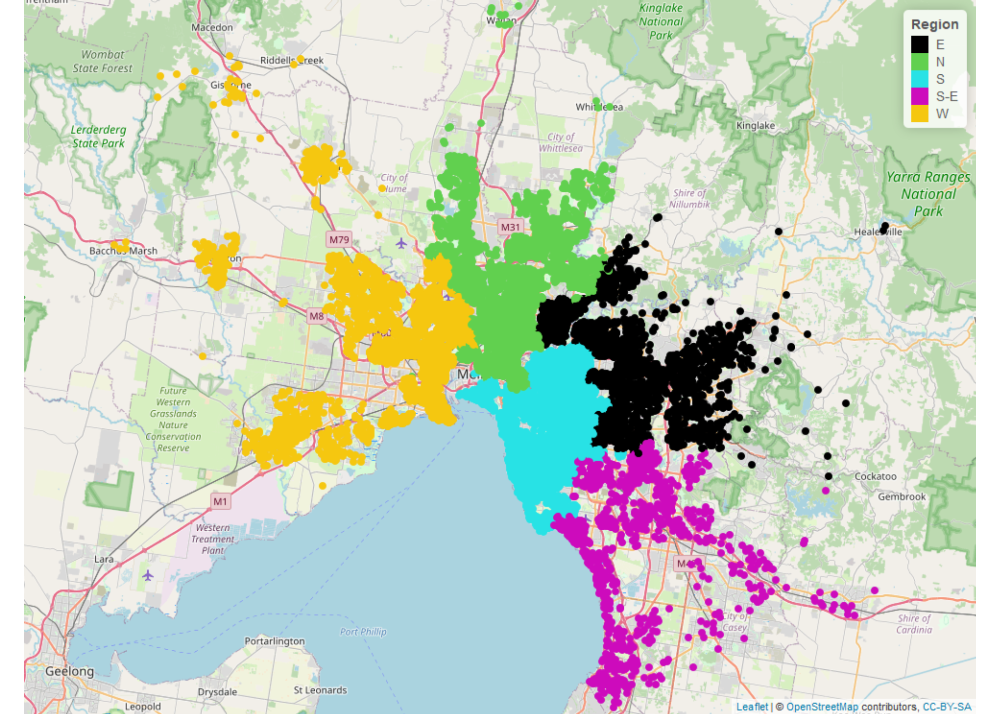

The `S-E` region contains less properties than the other regions but the
differences between the regions are smaller than previously.

``` r
regions <- data.frame(table(df$Region))
colnames(regions) <- c("Region", "Count")

g <- ggplot(regions, aes(x = Region, y = Count, fill = Region)) +
     geom_bar(stat = "identity") +
     theme(
       axis.text.x = element_text(size = 10),
       axis.text.y = element_text(size = 10),
       legend.position = "none",
       plot.title = element_text(hjust = 0.5, size = 14),
       axis.title = element_text(size = 12),
       panel.background = element_rect(fill = "#F0F0F0")
     ) +
     labs(x = "Region", y = "Number of properties", title = "Number of properties per region")

save_ggplot_and_show("images/properties_per_region.png", g)
```

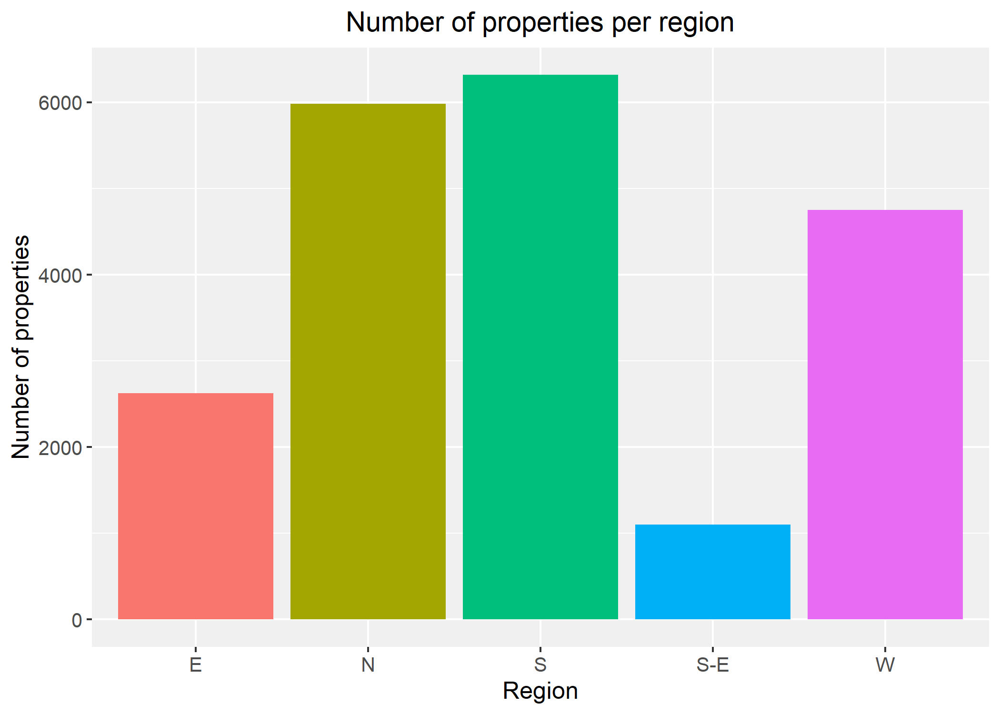

Choose only the variables that will be used in MCA. We don’t need `Lat`
and `Lon` anymore now that the k-NN algorithm has regrouped the
properties in terms of the regions.

``` r
df <- subset(df, select = -c(Lat, Lon))
```

Let’s analyse the number of rooms. Because MCA is sensitive to having
categories of very different sizes, let’s regroup the number of rooms
into more sensible categories in terms of MCA.

``` r
g <- ggplot(df, aes(x = Rooms)) +
     geom_histogram(binwidth = 1, col = "black", fill = "#00B9DE") +
     theme(
       axis.text.x = element_text(size = 10),
       axis.text.y = element_text(size = 10),
       plot.title = element_text(hjust = 0.5, size = 14),
       axis.title = element_text(size = 12),
       panel.background = element_rect(fill = "#F0F0F0")
     ) +
    labs(x = "Number of rooms", y = "Number of properties",
          title = "Histogram of the number of rooms") +
     scale_x_continuous(
       breaks = seq(0, max(df$Rooms), by = 1)
     )

save_ggplot_and_show("images/histogram_rooms.png", g)
```

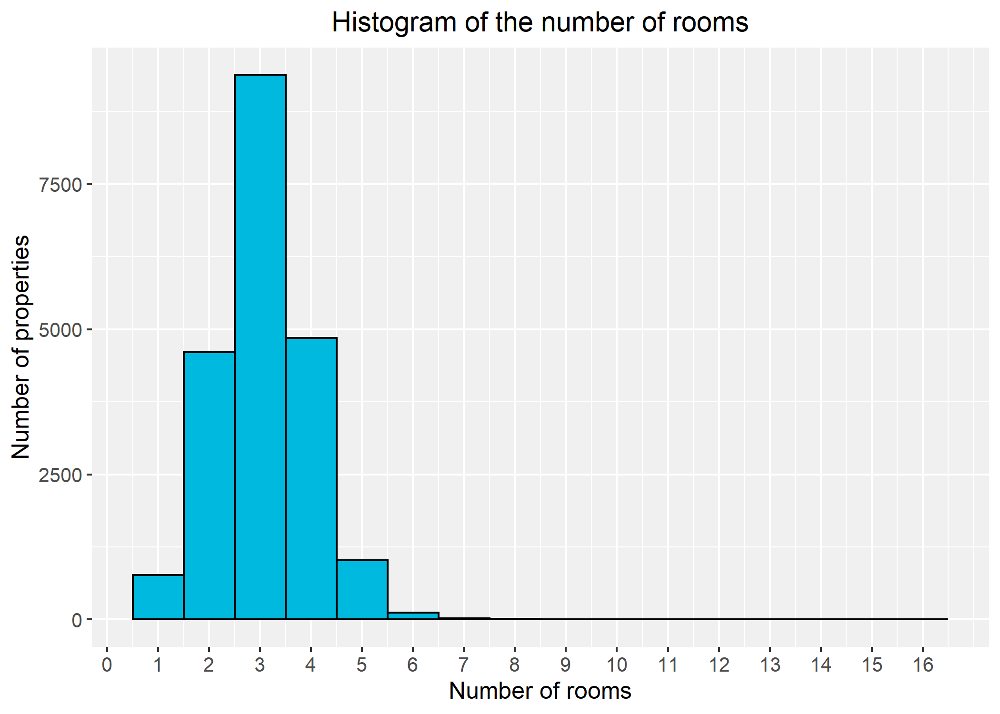

``` r
quantile(df$Rooms, c(0.25, 0.50, 0.75))
## Results:
##
## 25% 50% 75% 
##   2   3   4

i <- df$Rooms <= 2
j <- df$Rooms > 2 & df$Rooms <= 3
k <- df$Rooms >= 4

length(df$Rooms[i])  # Result: 5373
length(df$Rooms[j])  # Result: 9382
length(df$Rooms[k])  # Result: 6023

# Now that the `Rooms` variable is regrouped, let's relabel the variable.
df[i, "Rooms"] <- "1-2"
df[j, "Rooms"] <- "3"
df[k, "Rooms"] <- ">=4"
```

Let’s proceed similarly with the number of bathrooms:

``` r
g <- ggplot(df, aes(x = Bath)) +
     geom_histogram(binwidth = 1, col = "black", fill = "#00B9DE") +
     theme(
       axis.text.x = element_text(size = 10),
       axis.text.y = element_text(size = 10),
       legend.position = "none",
       plot.title = element_text(hjust = 0.5, size = 14),
       axis.title = element_text(size = 12),
       panel.background = element_rect(fill = "#F0F0F0")
     ) +
     labs(x = "Number of bathrooms", y = "Number of properties",
          title = "Histogram of the number of bathrooms") +
     scale_x_continuous(
       breaks = seq(0, max(df$Bath), by = 1)
     )

save_ggplot_and_show("images/histogram_baths.png", g)
```

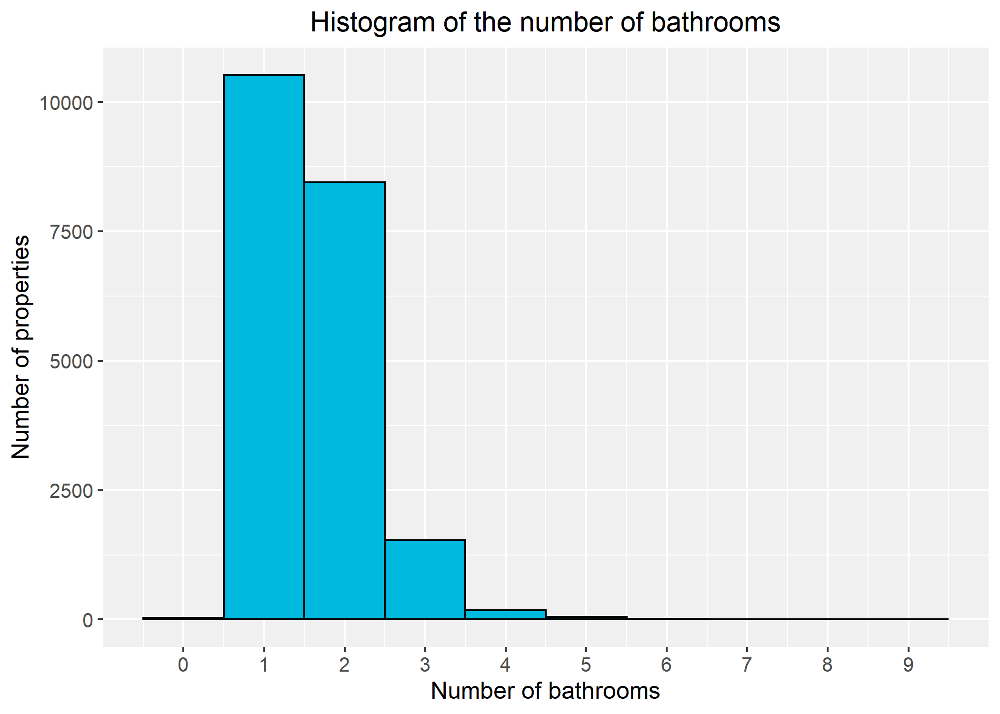

``` r
quantile(df$Bath, c(0.25, 0.50, 0.75))
## Results:
##
## 25% 50% 75% 
##   1   1   2

i <- df$Bath <= 1
j <- df$Bath >= 2

sum(i)  # Result: 10556
sum(j)  # Result: 10222

df[i, "Bath"] <- "<=1"
df[j, "Bath"] <- ">=2"
```

Let’s proceed similarly with the price variable:

``` r
g <- ggplot(df, aes(x = Price)) +
     geom_histogram(col = "black", fill = "#00B9DE", bins = 40) +
     theme(
       axis.text.x = element_text(angle = 90, vjust = 0.5, hjust=1, size = 10),
       axis.text.y = element_text(size = 10),
       legend.position = "none",
       plot.title = element_text(hjust = 0.5, size = 14),
       axis.title = element_text(size = 12),
       panel.background = element_rect(fill = "#F0F0F0")
     ) +
     labs(
       x = "Price",
       y = "Number of properties",
       title = "Histogram of the property prices"
     ) +
     scale_x_continuous(
       labels = scientific_format(digits = 2),
       breaks = seq(0, max(df$Price), by = 5e5)
     )

save_ggplot_and_show("images/histogram_price.png", g)
```

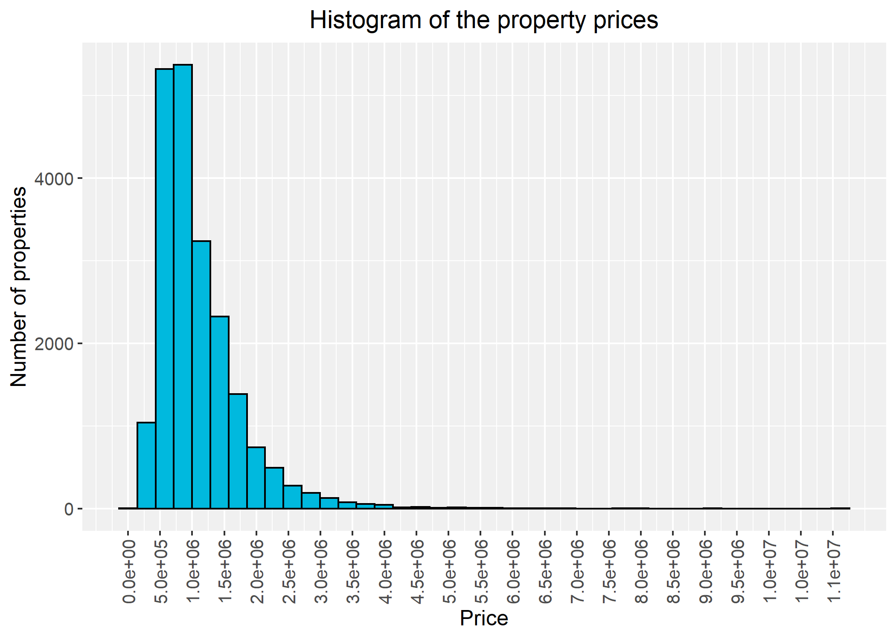

``` r
quantile(df$Price, c(0.25, 0.50, 0.75))
## Results:
##
##     25%     50%     75% 
##  660000  910000 1335000

i <- df$Price < 650000
j <- df$Price >= 650000 & df$Price < 900000
k <- df$Price >= 900000 & df$Price < 1350000
l <- df$Price >= 1350000

df[i, "Price"] <- "1"
df[j, "Price"] <- "2"
df[k, "Price"] <- "3"
df[l, "Price"] <- "4"
```

And similarly with the distance from the city center:

``` r
g <- ggplot(df, aes(x = Dist)) +
     geom_histogram(col = "black", fill = "#00B9DE", binwidth = 2) +
     theme(
       axis.text.x = element_text(size = 10),
       axis.text.y = element_text(size = 10),
       legend.position = "none",
       plot.title = element_text(hjust = 0.5, size = 14),
       axis.title = element_text(size = 12),
       panel.background = element_rect(fill = "#F0F0F0")
     ) +
     labs(
       x = "Distance to central business district (km)",
       y = "Number of properties",
       title = "Histogram of the distances to CBD"
     ) +
     scale_x_continuous(
       breaks = seq(0, max(df$Dist), by = 5)
     )

save_ggplot_and_show("images/histogram_dist.png", g)
```

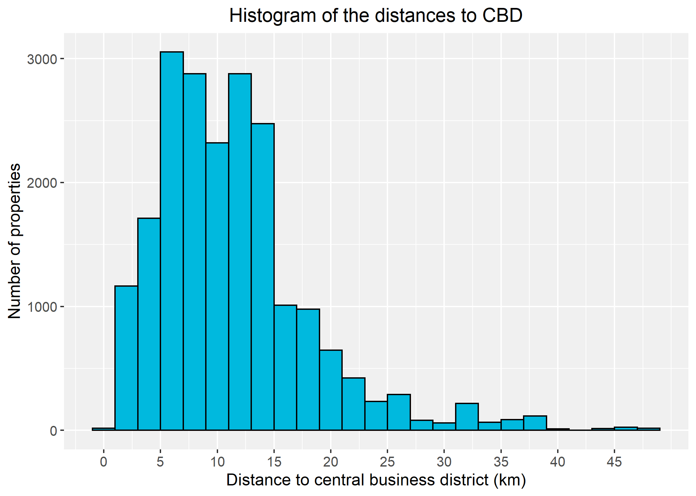

``` r
quantile(df$Dist, c(0.25, 0.50, 0.75))
## Results:
##
##  25%  50%  75% 
##  6.4 10.4 14.2

i <- df$Dist < 5.0
j <- df$Dist >= 5.0 & df$Dist < 10.0
k <- df$Dist >= 10.0 & df$Dist < 15.0
l <- df$Dist >= 15.0

sum(i)  # Result: 2847
sum(j)  # Result: 7013
sum(k)  # Result: 6602
sum(l)  # Result: 4316

df[i, "Dist"] <- "close"
df[j, "Dist"] <- "quite close"
df[k, "Dist"] <- "quite far"
df[l, "Dist"] <- "far"
```

After all the preprocessing, the actual multiple corresponding analysis
can begin! We will use the `mjca` function and perform the analysis on
the indicator matrix (`lambda = "indicator"`). The indicator matrix is
included in the output because of `reti = T` and we want to include 6
dimensions in the output (`nd = 6`) to be able to analyse the quality of
representation of the first 6 dimensions.

``` r
mca <- mjca(df, lambda = "indicator", reti = T, nd = 6)
s <- summary(mca)
s
```

    ## 
    ## Principal inertias (eigenvalues):
    ## 
    ##  dim    value      %   cum%   scree plot               
    ##  1      0.413617  15.9  15.9  ****                     
    ##  2      0.341824  13.1  29.1  ***                      
    ##  3      0.263005  10.1  39.2  ***                      
    ##  4      0.232464   8.9  48.1  **                       
    ##  5      0.210699   8.1  56.2  **                       
    ##  6      0.206381   7.9  64.2  **                       
    ##  7      0.196897   7.6  71.7  **                       
    ##  8      0.183142   7.0  78.8  **                       
    ##  9      0.162324   6.2  85.0  **                       
    ##  10     0.146887   5.6  90.7  *                        
    ##  11     0.109080   4.2  94.9  *                        
    ##  12     0.084401   3.2  98.1  *                        
    ##  13     0.049279   1.9 100.0                           
    ##         -------- -----                                 
    ##  Total: 2.600000 100.0                                 
    ## 
    ## 
    ## Columns:
    ##                  name   mass  qlt  inr     k=1 cor ctr     k=2 cor ctr     k=3
    ## 1  |        Rooms:>=4 |   58  592   63 |  1060 459 158 |   285  33  14 |   271
    ## 2  |        Rooms:1-2 |   52  723   70 | -1238 534 192 |   192  13   6 |   392
    ## 3  |          Rooms:3 |   90  481   36 |    28   1   0 |  -293  71  23 |  -399
    ## 4  |         Bath:<=1 |  102  623   46 |  -747 576 137 |  -124  16   5 |  -126
    ## 5  |         Bath:>=2 |   98  623   47 |   771 576 142 |   128  16   5 |   131
    ## 6  |          Price:1 |   47  687   59 |  -831 213  79 |  -436  59  26 |   265
    ## 7  |          Price:2 |   50  580   50 |   -61   1   0 |  -631 132  58 |  -370
    ## 8  |          Price:3 |   54  740   47 |   145   8   3 |  -106   4   2 |  -179
    ## 9  |          Price:4 |   49  703   65 |   700 160  58 |  1170 448 197 |   316
    ## 10 |       Dist:close |   27  621   64 |  -894 127  53 |   633  64  32 |  1329
    ## 11 |         Dist:far |   42  774   70 |   700 128  49 | -1336 468 217 |   751
    ## 12 | Dist:quite close |   68  762   46 |  -229  27   9 |   426  92  36 |  -396
    ## 13 |   Dist:quite far |   64  762   45 |   171  14   4 |   148  10   4 |  -644
    ## 14 |         Region:E |   25  623   61 |   904 118  50 |  -446  29  15 |  -300
    ## 15 |         Region:N |   58  468   50 |  -547 121  42 |  -227  21   9 |   446
    ## 16 |         Region:S |   61  564   54 |    28   0   0 |  1029 462 188 |   243
    ## 17 |       Region:S-E |   11  562   72 |   974  53  24 | -2205 272 151 |  1753
    ## 18 |         Region:W |   46  637   53 |   -73   2   1 |  -325  31  14 | -1125
    ##    cor ctr     k=4 cor ctr    k=5 cor ctr     k=6 cor ctr  
    ## 1   30  16 |  -290  34  21 |  -43   1   1 |   294  35  24 |
    ## 2   54  30 |  -229  18  12 | -326  37  26 |   436  66  48 |
    ## 3  131  55 |   317  83  39 |  214  38  20 |  -438 158  84 |
    ## 4   16   6 |    65   4   2 |  -81   7   3 |    54   3   1 |
    ## 5   16   6 |   -67   4   2 |   84   7   3 |   -56   3   1 |
    ## 6   22  13 |  -710 155 102 | -666 137  99 |   572 101  75 |
    ## 7   45  26 |    44   1   0 | -156   8   6 | -1089 393 286 |
    ## 8   12   7 |   831 254 160 |  768 217 151 |   816 245 174 |
    ## 9   33  19 |  -272  24  16 |  -44   1   0 |  -340  38  28 |
    ## 10 280 184 |   812 105  78 |  270  12  10 |  -462  34  28 |
    ## 11 148  89 |  -296  23  16 |  -68   1   1 |   141   5   4 |
    ## 12  80  40 |  -570 166  94 |  848 367 231 |   244  30  20 |
    ## 13 193 100 |   449  94  55 | -973 441 286 |  -152  11   7 |
    ## 14  13   9 |  1155 193 145 | -670  65  54 |  1188 204 173 |
    ## 15  80  44 |   516 108  66 |  463  87  59 |  -353  50  35 |
    ## 16  26  14 |  -161  11   7 | -365  58  38 |  -118   6   4 |
    ## 17 172 124 | -1000  56  45 |  129   1   1 |  -402   9   8 |
    ## 18 375 220 |  -844 211 140 |  242  17  13 |    38   0   0 |

``` r
# The `cor` column in the summary output gives the quality of representation (qlt)
# of the category with respect to the kth axis. To calculate the qlt with
# respect to the first 2 axes, for example, we can sum the first two `cor`
# values together.
qlt12 <- s$columns[, 6] + s$columns[, 9]
qlt34 <- s$columns[, 12] + s$columns[, 15]
qlt56 <- s$columns[, 18] + s$columns[, 21]

# A `cor` value 1000 means perfect quality of representation of the category with
# respect to the corresponding axis. Let's define some linear function for scaling
# the point sizes in the plots according to the qlt.
scale_qlt <- function(x) (x / 1000)
point_sizes <- function(qlt) (2 + 5 * scale_qlt(qlt))

qlt <- s$columns[, 3]
```

First, let’s plot the column principal coordinates of the first two
dimensions.

``` r
covariates <- data.frame(mca$colpcoord[, 1:2])

g <- ggplot(covariates, aes(x = X1, y = X2, xend = 0, yend = 0)) +
     geom_vline(xintercept = 0, lty = 2) +
     geom_hline(yintercept = 0, lty = 2) +
     geom_segment(color = "red") +
     geom_point(size = point_sizes(qlt12), colour = "black", fill = "red", pch = 21, stroke = 0.6) +
     geom_text(label = mca$levelnames, position = position_jitter(width = 0.12, height = 0.12)) +
     theme(
       axis.text.x = element_text(size = 10),
       axis.text.y = element_text(size = 10),
       plot.title = element_text(hjust = 0.5, size = 14),
       axis.title = element_text(size = 12),
       panel.background = element_rect(fill = "#F0F0F0")
     ) +
     labs(
       x = paste0("Dimension 1", " (", s$scree[1, 3], "%", ")"),
       y = paste0("Dimension 2", " (", s$scree[2, 3], "%", ")"),
       title = "Column principal coordinates for dimensions 1 and 2"
     )

save_ggplot_and_show("images/principal_coords_12.png", g)
```

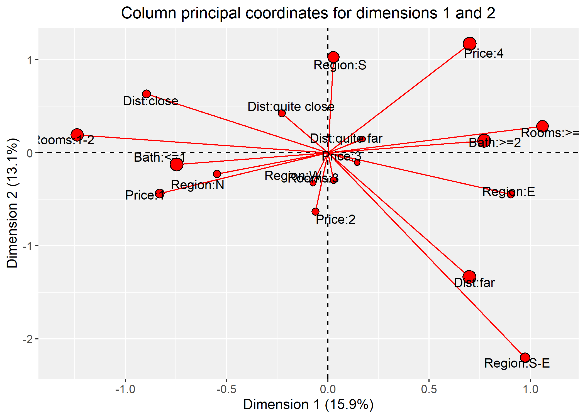

When analyzing the figure, we should focus on the largest circles only,
i.e. the categories with the highest quality of representation with
respect to the two axes. The representation of the axes are determined
by the categories that stretch out the furthest away from the origin in
the direction of the corresponding axis. According to the figure, the
first dimension is mostly represented by the number of rooms and
bathrooms the property has. The second dimension is determined by both
the location and the price of a property.

A pair of categories with a smaller angle than 90 degrees are said to
attract each other, meaning that there are more properties that belong
to both categories than there would be under independence. For example,
`Region: S` and `Price: 4` have a smaller angle than 90 degrees (in fact
around 45 deg) meaning that properties in Southern Metropolitan area
tend to be very expensive.

Similarly, we can also also plot the column principal coordinates of the
dimensions (3, 4) and (5, 6).

``` r
covariates <- data.frame(mca$colpcoord[, 3:4])

g <- ggplot(covariates, aes(x = X1, y = X2, xend = 0, yend = 0)) +
     geom_vline(xintercept = 0, lty = 2) +
     geom_hline(yintercept = 0, lty = 2) +
     geom_segment(color = "red") +
     geom_point(size = point_sizes(qlt34), colour = "black", fill = "red", pch = 21, stroke = 0.6) +
     geom_text(label = mca$levelnames, position = position_jitter(width = 0.12, height = 0.12)) +
     theme(
       axis.text.x = element_text(size = 10),
       axis.text.y = element_text(size = 10),
       plot.title = element_text(hjust = 0.5, size = 14),
       axis.title = element_text(size = 12),
       panel.background = element_rect(fill = "#F0F0F0")
     ) +
     labs(
       x = paste0("Dimension 3", " (", s$scree[3, 3], "%", ")"),
       y = paste0("Dimension 4", " (", s$scree[4, 3], "%", ")"),
       title = "Column principal coordinates for dimensions 3 and 4"
     )

save_ggplot_and_show("images/principal_coords_34.png", g)
```

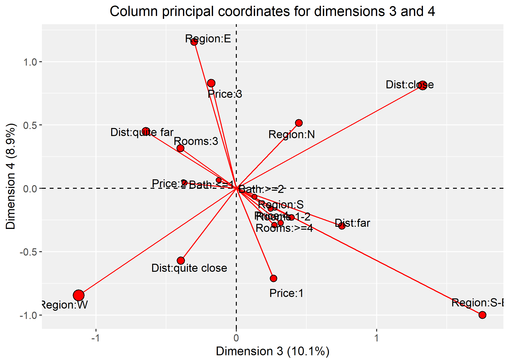

``` r
covariates <- data.frame(mca$colpcoord[, 5:6])

g <- ggplot(covariates, aes(x = X1, y = X2, xend = 0, yend = 0)) +
     geom_vline(xintercept = 0, lty = 2) +
     geom_hline(yintercept = 0, lty = 2) +
     geom_segment(color = "red") +
     geom_point(size = point_sizes(qlt56), colour = "black", fill = "red", pch = 21, stroke = 0.6) +
     geom_text(label = mca$levelnames, position = position_jitter(width = 0.12, height = 0.12)) +
     theme(
       axis.text.x = element_text(size = 10),
       axis.text.y = element_text(size = 10),
       plot.title = element_text(hjust = 0.5, size = 14),
       axis.title = element_text(size = 12),
       panel.background = element_rect(fill = "#F0F0F0")
     ) +
     labs(
       x = paste0("Dimension 5", " (", s$scree[5, 3], "%", ")"),
       y = paste0("Dimension 6", " (", s$scree[6, 3], "%", ")"),
       title = "Column principal coordinates for dimensions 5 and 6"
     )

save_ggplot_and_show("images/principal_coords_56.png", g)
```

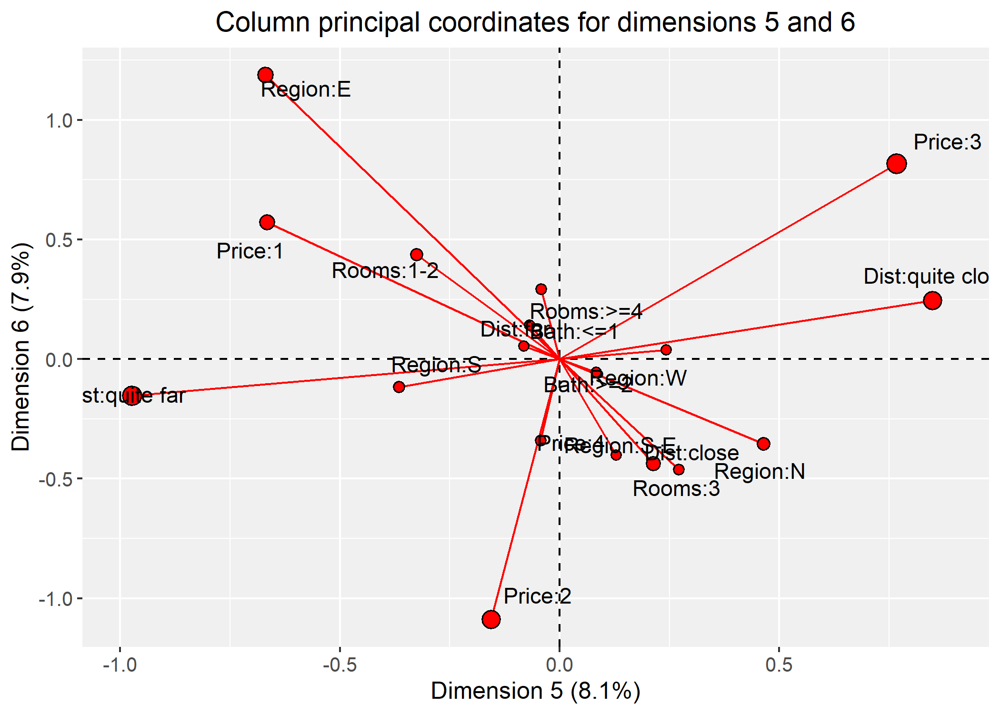

A more detailed explanation about the results of the analysis can be
found in the `project-report.pdf`. The project report also focuses on
justifying all the steps of this tutorial more in-depth.
